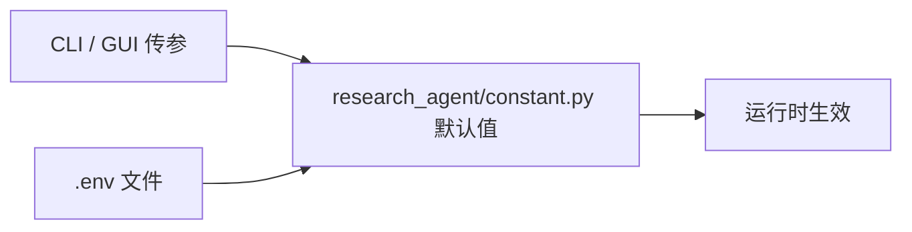

# AI-Researcher 部署与启动指南

本文档说明如何在本机部署 AI-Researcher、适配配置文件，并以 Web GUI 或命令行方式启动三种运行模式。更完整的项目介绍见 [README_zh.md](./README_zh.md)，系统结构见 [系统架构.md](./系统架构.md)。

---

## 目录

- [1. 前置条件](#1-前置条件)
- [2. 安装步骤](#2-安装步骤)
- [3. 配置文件体系](#3-配置文件体系)
- [4. 环境变量详解](#4-环境变量详解)
- [5. 配置适配场景](#5-配置适配场景)
- [6. 启动方式](#6-启动方式)
- [7. 研究产出与论文输入衔接](#7-研究产出与论文输入衔接)
- [8. 端到端验证清单](#8-端到端验证清单)
- [9. 常见问题 FAQ](#9-常见问题-faq)

---

## 1. 前置条件

### 1.1 硬件与系统

| 项目 | 要求 |
|------|------|
| 操作系统 | Linux / macOS / Windows（WSL2 推荐） |
| Python | **3.11+**（见 [setup.cfg](../setup.cfg)、[requirements.txt](../requirements.txt)） |
| Docker | Docker Desktop 或 Docker Engine（Research Agent 代码执行必需） |
| GPU | 可选；ML Agent 在容器内训练时建议配备 NVIDIA GPU + [NVIDIA Container Toolkit](https://docs.nvidia.com/datacenter/cloud-native/container-toolkit/install-guide.html) |
| 磁盘 | 建议 ≥ 20 GB（Docker 镜像、依赖、workplace 产出） |
| 内存 | 建议 ≥ 16 GB |

### 1.2 软件依赖

| 工具 | 用途 | 安装方式 |
|------|------|----------|
| [uv](https://docs.astral.sh/uv/) 或 pip | Python 包管理 | `pip install -r requirements.txt`（见下文） |
| Playwright 浏览器 | Browser Agent 网页交互 | `playwright install` |
| pdflatex | Paper Agent 编译 PDF | 系统级 TeX 发行版（TeX Live / MacTeX） |
| git | 克隆仓库、Agent 拉代码 | 系统自带或包管理器安装 |

### 1.3 网络与 API

- 可访问 LLM API（OpenRouter / OpenAI / 兼容端点）
- 可访问 GitHub、arXiv、Docker Hub
- 若使用 Web 搜索工具，需配置 `GOOGLE_API_KEY` 与 `SEARCH_ENGINE_ID`

### 1.4 已知依赖缺口（部署前注意）

以下问题来自当前源码，部署文档中给出 workaround，**不修改源码也可按说明运行**：

1. **`PLATFORM` 环境变量未在 `constant.py` 中定义**  
   [docker_env.py](../research_agent/inno/environment/docker_env.py) 从 `constant` 导入 `PLATFORM`，但 [constant.py](../research_agent/constant.py) 缺少该变量，首次创建 Docker 容器可能报 `ImportError`。  
   **Workaround**：在 `research_agent/constant.py` 末尾添加：
   ```python
   PLATFORM = os.getenv('PLATFORM', 'linux/amd64')
   ```
   并在 `.env` 中设置 `PLATFORM=linux/amd64`（Apple Silicon 拉取 amd64 镜像时常用）。

2. **Web GUI 硬编码代理**  
   [web_ai_researcher.py](../web_ai_researcher.py) 第 21–23 行写死了 `http_proxy`/`https_proxy`。非该内网环境请注释这三行后再启动 GUI。

3. **`setup.cfg` 中 console_scripts 不可用**  
   `ai-researcher`、`paper-agent`、`benchmark` 指向不存在的 `cli.py`，请使用本文档中的 Python 入口命令。

---

## 2. 安装步骤

### 2.1 克隆与 Python 环境

项目根目录提供 [requirements.txt](../requirements.txt)，以 editable 模式（`-e .`）安装本项目，并从 [setup.cfg](../setup.cfg) 的 `install_requires` 拉取全部 Python 依赖（含 `python-dotenv`、`litellm`、`gradio` 等）。

**方式 A：uv（推荐）**

```bash
# 安装 uv（可选）
curl -LsSf https://astral.sh/uv/install.sh | sh
source ~/.bashrc   # 或 ~/.zshrc

# 克隆项目
git clone https://github.com/HKUDS/AI-Researcher.git
cd AI-Researcher

# 创建虚拟环境并安装
uv venv --python 3.11
source .venv/bin/activate          # Windows: .venv\Scripts\activate
uv pip install -r requirements.txt
playwright install
```

**方式 B：pip**

```bash
git clone https://github.com/HKUDS/AI-Researcher.git
cd AI-Researcher

python3.11 -m venv .venv
source .venv/bin/activate          # Windows: .venv\Scripts\activate
pip install -r requirements.txt
playwright install
```

> **说明**：`requirements.txt` 不包含 Playwright 浏览器二进制，安装 Python 包后仍需执行 `playwright install`。

### 2.2 配置文件初始化

```bash
cp .env.template .env
# 编辑 .env，填入 API Key 与任务参数（见第 4、5 节）
```

> **注意**：若先启动 Web GUI 且本地无 `.env`，GUI 会写入 [web_ai_researcher.py](../web_ai_researcher.py) 中的 `DEFAULT_ENV_TEMPLATE`，该模板**不含** `CATEGORY`、`BASE_IMAGES` 等研究任务变量。建议始终从 `.env.template` 复制。

### 2.3 Docker 研究执行环境

Research Agent 在 Docker 容器内执行代码与训练：

```bash
# 方式 A：拉取官方镜像（推荐）
docker pull tjbtech1/airesearcher:v1

# 方式 B：本地构建
cd docker && docker build -t tjbtech1/airesearcher:v1 .
```

容器内进程链：

```
supervisord → python /app/tcp_server.py（监听 8000）
```

宿主机通过环境变量 `PORT` 映射到容器 8000，例如 `PORT=7020` 即 `-p 7020:8000`。

验证 Docker：

```bash
docker ps
docker run --rm hello-world
```

### 2.4 可选：LaTeX（Paper Agent）

Paper Agent 调用 [paper_agent/tex_writer.py](../paper_agent/tex_writer.py) 编译 PDF，需本机安装 TeX：

```bash
# macOS
brew install --cask mactex-no-gui

# Ubuntu/Debian
sudo apt-get install texlive-full

# 验证
pdflatex --version
```

---

## 3. 配置文件体系

项目存在三套配置来源，优先级如下：



| 配置来源 | 路径 | 用途 |
|----------|------|------|
| 官方模板 | [.env.template](../.env.template) | 容器、LLM、任务配置（**推荐**复制为 `.env`） |
| Web GUI 初始化模板 | [web_ai_researcher.py](../web_ai_researcher.py) `DEFAULT_ENV_TEMPLATE` | 仅 OpenAI / Qwen / DeepSeek 等 API Key，**不含**研究任务变量 |
| 代码默认值 | [research_agent/constant.py](../research_agent/constant.py) | 未设置 `.env` 时的 fallback（与模板存在差异） |

### 3.1 默认 Docker 镜像不一致

各来源默认镜像不同，**务必在 `.env` 中显式统一**：

| 来源 | 默认 `BASE_IMAGES` |
|------|---------------------|
| `.env.template` | `tjbtech1/airesearcher:v1` |
| `constant.py` | `tjbtech1/paperapp:latest` |
| `run_infer_level_1.sh` | `tjbtech1/metachain:amd64_latest` |
| README shell 示例 | `tjbtech1/paperagent:latest` |

**推荐统一为**：

```bash
BASE_IMAGES=tjbtech1/airesearcher:v1
```

---

## 4. 环境变量详解

### 4.1 容器组

| 变量 | 示例值 | 含义 | 影响模块 |
|------|--------|------|----------|
| `DOCKER_WORKPLACE_NAME` | `workplace_paper` | 工作区根目录命名空间 | `run_infer_*.py` 产出路径 |
| `BASE_IMAGES` | `tjbtech1/airesearcher:v1` | Docker 基础镜像 | [docker_env.py](../research_agent/inno/environment/docker_env.py) |
| `GPUS` | `'"device=0"'` | Docker `--gpus` 参数；`None` 或不设置表示不用 GPU | 同上 |
| `CONTAINER_NAME` | `paper_eval` | 容器名前缀（运行时会追加 `instance_id` 与 model） | 同上 |
| `WORKPLACE_NAME` | `workplace` | 挂载到容器内的子目录名 | 同上 |
| `PORT` | `7020` | 宿主机端口 → 容器 **8000** | TCP 命令执行 |
| `PLATFORM` | `linux/amd64` | Docker `--platform`（ARM Mac 常用） | 同上 |
| `CACHE_PATH` | `cache` | CLI 缓存路径参数（由 GUI/CLI 传入） | FlowModule |

`GPUS` 取值说明：

```bash
GPUS='"device=0"'      # 使用第一块 GPU
GPUS='"device=0,1"'    # 使用前两块 GPU
GPUS='"all"'           # 使用全部 GPU
# 不设置或 GPUS=None   # 不使用 GPU
```

### 4.2 LLM 组

| 变量 | 示例值 | 含义 | 影响模块 |
|------|--------|------|----------|
| `COMPLETION_MODEL` | `openrouter/google/gemini-2.5-pro-preview-05-20` | 主模型（ML Agent 等），LiteLLM 格式 | [inno/core.py](../research_agent/inno/core.py) |
| `CHEEP_MODEL` | 同上或更便宜模型 | 辅助模型（Prepare、Survey、Judge 等） | 各 Agent 工厂函数 |
| `OPENROUTER_API_KEY` | `sk-or-...` | OpenRouter API 密钥 | LiteLLM 自动读取 |
| `OPENROUTER_API_BASE` | `https://openrouter.ai/api/v1` | OpenRouter Base URL | 同上 |
| `OPENAI_API_KEY` | `sk-...` | OpenAI 或兼容 API 密钥 | Paper Agent、RAG 嵌入 |
| `API_BASE_URL` | `https://api.openai.com/v1` | OpenAI 兼容代理地址 | Paper Agent、[openai_utils.py](../benchmark_collection/utils/openai_utils.py) |
| `EMBEDDING_MODEL` | `text-embedding-3-small` | 嵌入模型 | RAG 记忆 |

LiteLLM 模型名格式参考：[LiteLLM 文档](https://docs.litellm.ai/docs/)。示例：

```bash
COMPLETION_MODEL=openrouter/google/gemini-2.5-pro-preview-05-20
COMPLETION_MODEL=anthropic/claude-3-5-sonnet-20241022
COMPLETION_MODEL=gpt-4o-2024-08-06
```

### 4.3 任务组

| 变量 | 示例值 | 含义 |
|------|--------|------|
| `CATEGORY` | `vq` | 研究领域，对应 `benchmark/final/{category}/` |
| `INSTANCE_ID` | `one_layer_vq` | 任务实例 ID，对应 `{instance_id}.json` |
| `TASK_LEVEL` | `task1` | 读取 JSON 中 `task1`（详细想法）或 `task2`（仅参考论文） |
| `MAX_ITER_TIMES` | `0` | Judge 后 ML Agent 精炼迭代次数；`0` 表示不迭代 |

`CATEGORY` 可选值：

| 值 | 说明 | 实例数量 |
|----|------|----------|
| `vq` | 向量量化 | 7 |
| `gnn` | 图神经网络 | 9 |
| `recommendation` | 推荐系统 | 6 |
| `diffu_flow` | 扩散与 Flow Matching | 4 |
| `reasoning` | 推理 | 2 |

完整实例列表见 [benchmark/final/](../benchmark/final/) 目录。

### 4.4 工具组

| 变量 | 含义 |
|------|------|
| `GITHUB_AI_TOKEN` | GitHub API / clone 认证 |
| `GOOGLE_API_KEY` | Google 搜索 API |
| `SEARCH_ENGINE_ID` | Google Custom Search Engine ID |
| `AI_USER` | Git clone 用户名（默认 `ai-sin`） |
| `DEBUG` | 调试输出开关（默认 `True`） |

### 4.5 完整 `.env.template` 示例

```bash
# ================ container configuration ================
DOCKER_WORKPLACE_NAME=workplace_paper
BASE_IMAGES=tjbtech1/airesearcher:v1
COMPLETION_MODEL=openrouter/google/gemini-2.5-pro-preview-05-20
CHEEP_MODEL=openrouter/google/gemini-2.5-pro-preview-05-20
GPUS='"device=0"'
CONTAINER_NAME=paper_eval
WORKPLACE_NAME=workplace
CACHE_PATH=cache
PORT=7020
PLATFORM=linux/amd64

# ================ llm configuration ================
GITHUB_AI_TOKEN=your_github_ai_token
OPENROUTER_API_KEY=your_openrouter_api_key
OPENROUTER_API_BASE=https://openrouter.ai/api/v1

# ================ task configuration ================
CATEGORY=vq
INSTANCE_ID=one_layer_vq
TASK_LEVEL=task1
MAX_ITER_TIMES=0
```

---

## 5. 配置适配场景

### 5.1 使用 OpenRouter

```bash
cp .env.template .env
# 编辑：
OPENROUTER_API_KEY=sk-or-v1-...
COMPLETION_MODEL=openrouter/google/gemini-2.5-pro-preview-05-20
CHEEP_MODEL=openrouter/google/gemini-2.5-flash-preview
BASE_IMAGES=tjbtech1/airesearcher:v1
```

### 5.2 使用 OpenAI 或兼容 API

Research Agent（LiteLLM）：

```bash
OPENAI_API_KEY=sk-...
API_BASE_URL=https://api.openai.com/v1   # 或自建代理地址
COMPLETION_MODEL=gpt-4o-2024-08-06
CHEEP_MODEL=gpt-4o-mini-2024-07-18
```

Paper Agent 单独依赖 `OPENAI_API_KEY`（[openai_utils.py](../benchmark_collection/utils/openai_utils.py)），生成论文前需 export：

```bash
export OPENAI_API_KEY=sk-...
export API_BASE_URL=https://api.openai.com/v1   # 可选
```

### 5.3 无 GPU 环境

```bash
# .env 中删除 GPUS 行，或设为：
GPUS=
```

ML Agent 会尝试 CPU 训练，部分 benchmark 任务可能超时或 OOM。

### 5.4 Apple Silicon / ARM 主机

```bash
PLATFORM=linux/amd64
docker pull --platform linux/amd64 tjbtech1/airesearcher:v1
```

并确保 `constant.py` 已补充 `PLATFORM` 变量（见 1.4 节）。

### 5.5 切换 Benchmark 任务

修改 `.env` 中两项即可，无需改代码：

```bash
CATEGORY=gnn
INSTANCE_ID=gnn_difformer
TASK_LEVEL=task2    # Level 2：使用 JSON 中 task2 字段作为任务描述
```

任务定义文件路径：`benchmark/final/{CATEGORY}/{INSTANCE_ID}.json`。

### 5.6 通过 Web GUI 管理环境变量

1. 启动 `python web_ai_researcher.py`
2. 打开 **Environment Variable Management** 标签页
3. 在表格中编辑变量名与值
4. 点击 **Save Changes** 写入 `.env`
5. 建议首次使用前执行 `cp .env.template .env`，再补充 API Key

GUI 运行时还会将前端修改同步到进程环境变量（`WEB_FRONTEND_ENV_VARS`），优先级高于文件。

---

## 6. 启动方式

### 6.1 方式一：Web GUI（推荐）

```bash
cd AI-Researcher
source .venv/bin/activate
python web_ai_researcher.py
```

浏览器访问：**http://127.0.0.1:7039**

调用链：

```
web_ai_researcher.py → main_ai_researcher.py → 按 mode 分发
```

Web GUI 三种模式（[MODULE_DESCRIPTIONS](../web_ai_researcher.py)）：

| 模式 | 说明 | 后端入口 |
|------|------|----------|
| `Detailed Idea Description` | Level 1：用户提供详细研究想法 | `run_infer_plan.main(args, input, reference)` |
| `Reference-Based Ideation` | Level 2：仅提供参考论文，自动生成想法 | `run_infer_idea.main(args, reference)` |
| `Paper Generation Agent` | 研究完成后生成论文 | `paper_agent.writing.writing(category, instance_id)` |

**GUI 操作流程**：

1. 在 Environment 标签页配置并保存 `.env`
2. 选择 **Select Mode**
3. 填写 **Question**（想法描述）和 **Reference**（参考论文列表）
4. 点击 **Run**，在日志标签页查看进度
5. 完成后使用 **Extract paper** 等按钮下载产出

### 6.2 方式二：Python 直接调用（编程式）

在项目根目录：

```python
from dotenv import load_dotenv
load_dotenv()

from main_ai_researcher import main_ai_researcher

# Level 1
main_ai_researcher(
    input="你的详细研究想法...",
    reference="参考论文列表...",
    mode="Detailed Idea Description",
)

# Level 2
main_ai_researcher(
    input="",  # Level 2 可不填
    reference="参考论文列表...",
    mode="Reference-Based Ideation",
)

# Paper Generation
main_ai_researcher(
    input="",
    reference="",
    mode="Paper Generation Agent",
)
```

`main_ai_researcher` 从 `.env` 读取 `CATEGORY`、`INSTANCE_ID` 等并构造 CLI 参数。

### 6.3 方式三：Paper Agent 独立启动

研究阶段完成后：

```bash
cd AI-Researcher
export OPENAI_API_KEY=sk-...

python paper_agent/writing.py \
  --research_field vq \
  --instance_id rotation_vq
```

输出 PDF 路径：

```
paper_agent/vq/target_sections/rotation_vq/iclr2025_conference.pdf
```

### 6.4 不推荐：直接运行 shell 脚本或 `run_infer_*.py`

以下方式**当前会失败或行为不完整**：

```bash
# ❌ main() 需要 ideas/references 参数，__main__ 仅传 args
python research_agent/run_infer_plan.py --instance_path ...

# ❌ 同上
bash research_agent/run_infer_level_1.sh
bash research_agent/run_infer_level_2.sh
```

请改用 Web GUI 或 6.2 节的 `main_ai_researcher` 调用。

---

## 7. 研究产出与论文输入衔接

Research Agent 与 Paper Agent **无 Python 级直接调用**，通过文件系统目录约定衔接。

### 7.1 Research Agent 产出路径

```
research_agent/workplace_paper/task_{INSTANCE_ID}_{MODEL}/
├── cache_{INSTANCE_ID}_{MODEL}/    # Agent 对话与 checkpoint
│   └── agents/
└── workplace/
    ├── project/                    # 生成的代码与实验结果
    └── papers/                     # 下载的 arXiv TeX
```

其中 `{MODEL}` 为 `COMPLETION_MODEL` 将 `/` 替换为 `__` 后的字符串。

### 7.2 Paper Agent 期望输入路径

[paper_agent/methodology_composing_using_template.py](../paper_agent/methodology_composing_using_template.py) 约定：

```
paper_agent/{research_field}/{instance_id}/
├── cache_*/                        # 必须存在
│   └── agents/
└── workplace/
    └── project/
        └── model/
```

### 7.3 手动同步（研究 → 论文）

```bash
# 示例：vq / rotation_vq，模型名 openrouter__google__gemini-2.5-pro-preview-05-20
SRC=research_agent/workplace_paper/task_rotation_vq_openrouter__google__gemini-2.5-pro-preview-05-20
DST=paper_agent/vq/rotation_vq

mkdir -p "$DST"
cp -r "$SRC/cache_"* "$DST/"
cp -r "$SRC/workplace" "$DST/"
```

然后在 `.env` 中设置：

```bash
CATEGORY=vq
INSTANCE_ID=rotation_vq
```

再运行 Paper Generation 模式或 `writing.py`。

### 7.4 Docker 容器生命周期

每个任务会创建名为 `{CONTAINER_NAME}_{instance_id}_{model}` 的容器，挂载 `{local_root}/{WORKPLACE_NAME}`。任务结束后容器默认 `--restart unless-stopped` 保持运行；如需清理：

```bash
docker ps -a | grep paper_eval
docker stop <container_id> && docker rm <container_id>
```

---

## 8. 端到端验证清单

按顺序执行 smoke test，确认环境可用：

- [ ] **1. Docker**：`docker ps` 无报错
- [ ] **2. Python 环境**：`pip install -r requirements.txt && playwright install`，然后 `python -c "import litellm, gradio, dotenv; print('ok')"`
- [ ] **3. 配置文件**：`cp .env.template .env` 并填入有效 API Key
- [ ] **4. PLATFORM workaround**：确认 `constant.py` 已补充 `PLATFORM`（见 1.4 节）
- [ ] **5. 代理**：非内网环境已注释 `web_ai_researcher.py` 中硬编码 proxy
- [ ] **6. 拉取镜像**：`docker pull tjbtech1/airesearcher:v1`
- [ ] **7. 启动 GUI**：`python web_ai_researcher.py`，访问 http://127.0.0.1:7039
- [ ] **8. 保存 env**：在 GUI Environment 标签页 Save Changes
- [ ] **9. 运行 Level 2**：选择 `Reference-Based Ideation`，`CATEGORY=vq`，`INSTANCE_ID=one_layer_vq`，输入参考论文，点击 Run
- [ ] **10. 检查产出**：`research_agent/workplace_paper/` 下出现 `workplace/project/`
- [ ] **11. 同步到 paper_agent**：按第 7.3 节复制目录
- [ ] **12. 生成论文**：`python paper_agent/writing.py --research_field vq --instance_id one_layer_vq`
- [ ] **13. 检查 PDF**：`paper_agent/vq/target_sections/one_layer_vq/iclr2025_conference.pdf` 存在

---

## 9. 常见问题 FAQ

### Q1：运行 `python run_infer_plan.py` 报 `TypeError: main() missing 2 required positional arguments`

**原因**：`main(args, ideas, references)` 需要三个参数，`__main__` 仅传入 `args`。

**解决**：使用 Web GUI 或 `main_ai_researcher()` 调用（见 6.1、6.2 节）。

### Q2：Docker 容器创建失败，`ImportError: cannot import name 'PLATFORM'`

**原因**：`constant.py` 未定义 `PLATFORM`。

**解决**：见 [1.4 节](#14-已知依赖缺口部署前注意)，在 `constant.py` 添加 `PLATFORM = os.getenv('PLATFORM', 'linux/amd64')`。

### Q3：LLM 调用失败 / 401 / 模型不存在

**排查**：

1. 确认 API Key 正确且已写入 `.env`
2. 确认 `COMPLETION_MODEL` 为 LiteLLM 支持的格式
3. OpenRouter 需设置 `OPENROUTER_API_KEY`
4. 检查是否被硬编码 proxy 拦截（注释 `web_ai_researcher.py` 第 21–23 行）
5. 查看 `logs/` 与 GUI 日志输出

### Q4：端口被占用

**现象**：容器或 GUI 启动失败。

**解决**：修改 `.env` 中 `PORT`（Docker）或使用其他端口启动 GUI（需改 [web_ai_researcher.py](../web_ai_researcher.py) 中 `server_port=7039`）。

### Q5：Paper Agent 报错 `No cache directory found`

**原因**：`paper_agent/{field}/{instance_id}/` 下缺少 `cache_*` 目录。

**解决**：按 [第 7 节](#7-研究产出与论文输入衔接) 从 research_agent 产出目录复制。

### Q6：LaTeX 编译失败

**原因**：本机未安装 `pdflatex` 或缺少宏包。

**解决**：安装 TeX Live / MacTeX；查看 `paper_agent/{field}/target_sections/{instance_id}/` 下 `.log` 文件。

### Q7：GPU 不可用或 OOM

**排查**：

1. `nvidia-smi` 确认驱动正常
2. `docker run --gpus all nvidia/cuda:11.6.2-base-ubuntu20.04 nvidia-smi` 确认容器 GPU
3. 调整 `GPUS='"device=0"'` 指定空闲卡
4. 无 GPU 时删除 `GPUS` 配置，接受 CPU 训练（较慢）

### Q8：Web GUI 启动后 `.env` 缺少任务变量

**原因**：GUI 首次创建 `.env` 时使用 `DEFAULT_ENV_TEMPLATE`，不含 `CATEGORY` 等。

**解决**：`cp .env.template .env` 后重新在 GUI 中 Save，或手动合并变量。

### Q9：`MAX_ITER_TIMES=0` 是什么意思？

Judge Agent 评估 ML 实现后，若 `MAX_ITER_TIMES=0` 则**不进行**额外的 Judge ↔ ML 精炼循环。设为 `1` 或更大可启用自动改进迭代（耗时更长、API 费用更高）。

---

## 相关文档

- [README_zh.md](./README_zh.md) — 项目介绍与示例
- [系统架构.md](./系统架构.md) — 架构图、流程图与模块依赖
