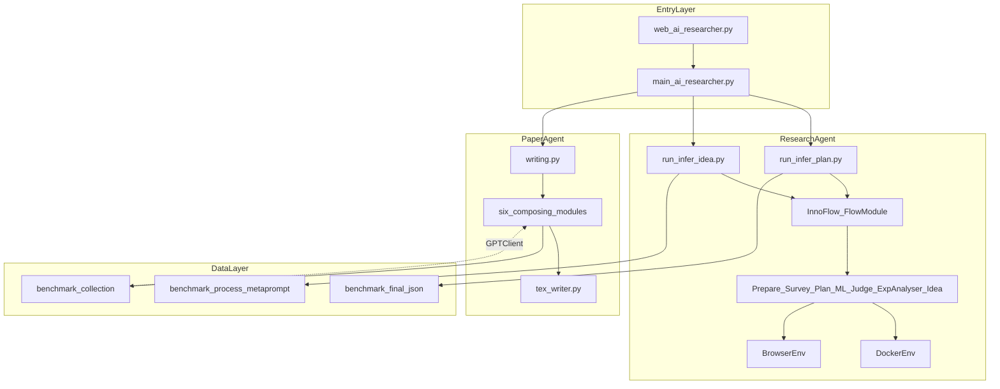
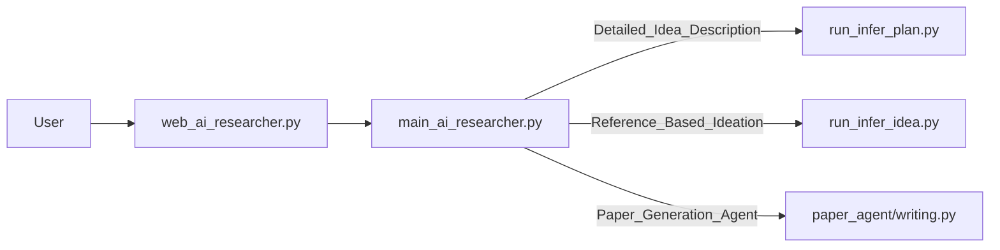
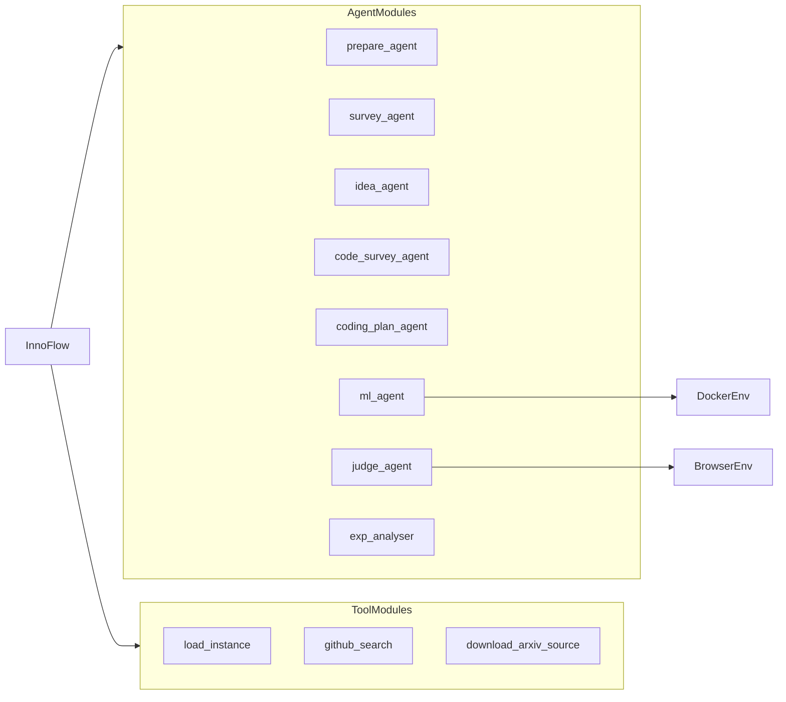
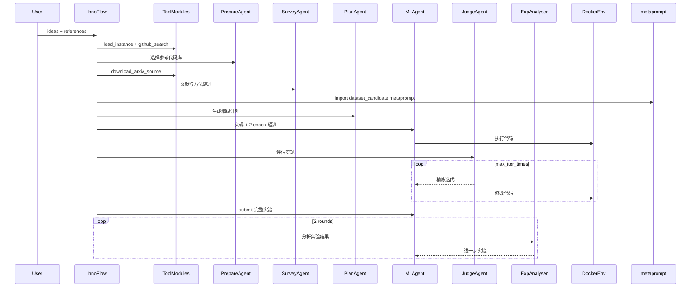
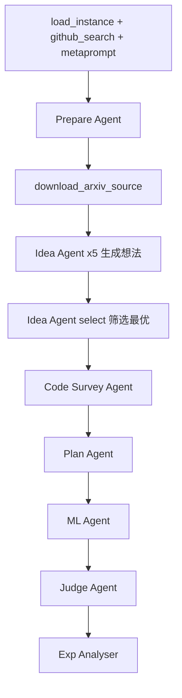
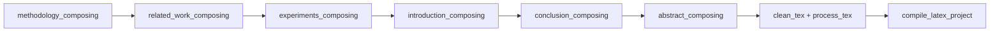
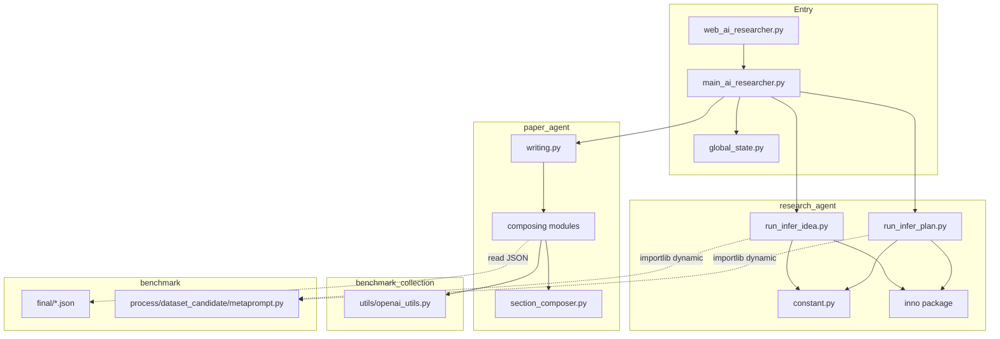
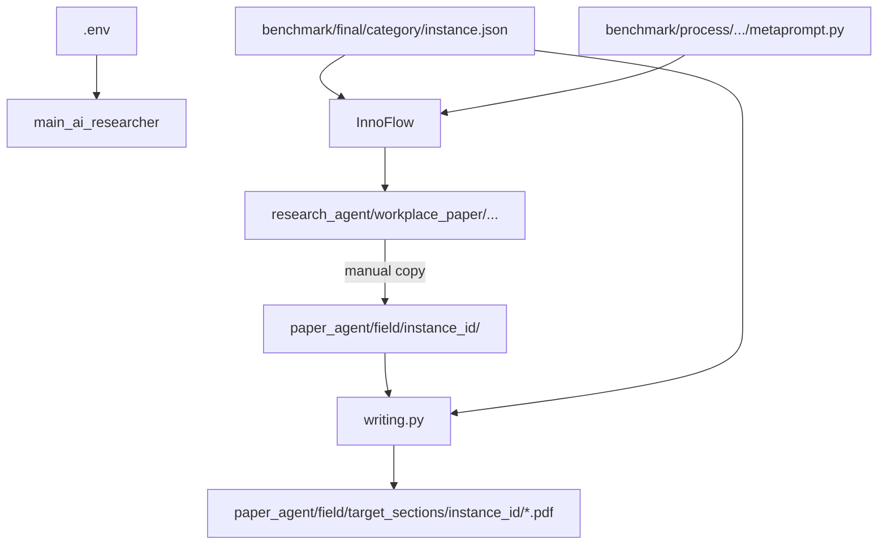

# AI-Researcher 系统架构

本文档基于源代码整理 AI-Researcher 的整体架构、运行流程与模块依赖关系。部署与配置说明见 [Start.md](./Start.md)，项目介绍见 [README_zh.md](./README_zh.md)。

---

## 目录

- [1. 项目总览](#1-项目总览)
- [2. 目录结构与职责](#2-目录结构与职责)
- [3. 入口层与运行模式](#3-入口层与运行模式)
- [4. research_agent 内部架构](#4-research_agent-内部架构)
- [5. 研究流水线流程](#5-研究流水线流程)
- [6. paper_agent 论文流水线](#6-paper_agent-论文流水线)
- [7. 模块与文件依赖图](#7-模块与文件依赖图)
- [8. 外部服务依赖](#8-外部服务依赖)
- [9. Benchmark 数据体系](#9-benchmark-数据体系)

---

## 1. 项目总览

AI-Researcher 是一个**端到端科研自动化**框架，将用户输入（研究想法或参考论文）经多 Agent 流水线转化为可运行代码、实验结果与 LaTeX 论文。系统分为三层：

1. **入口层**：Gradio Web GUI / Python CLI，统一路由三种运行模式
2. **研究层**：`research_agent.inno`（MetaChain）编排多 Agent，在 Docker 中实现与验证 ML 项目
3. **写作层**：`paper_agent` 独立流水线，基于模板与 LLM 生成 PDF 论文

`research_agent` 与 `paper_agent` **解耦**（无 Python 互调），通过 `workplace_paper/` 与 `paper_agent/{field}/{instance_id}/` 的文件约定衔接。

### 1.1 系统分层架构图



---

## 2. 目录结构与职责

| 目录/文件 | 路径 | 职责 |
|-----------|------|------|
| 入口脚本 | [web_ai_researcher.py](../web_ai_researcher.py) | Gradio Web GUI，环境变量管理，日志展示 |
| 统一路由 | [main_ai_researcher.py](../main_ai_researcher.py) | 按 `mode` 分发到 research / paper 流水线 |
| 全局状态 | [global_state.py](../global_state.py) | GUI 与 Agent 间共享 `INIT_FLAG`、`LOG_PATH` |
| 研究 Agent | [research_agent/](../research_agent/) | 多 Agent 研究流水线、Docker 执行环境 |
| 论文 Agent | [paper_agent/](../paper_agent/) | 分节 LaTeX 生成与 PDF 编译 |
| 评测数据 | [benchmark/](../benchmark/) | 任务 JSON、数据集 metaprompt、基线描述 |
| 数据集构建 | [benchmark_collection/](../benchmark_collection/) | 离线构建创新图谱；提供 `GPTClient` |
| Docker 环境 | [docker/](../docker/) | Agent 代码执行镜像、tcp_server、supervisord |
| 参考实现 | [examples/](../examples/) | 各 benchmark 实例的人类参考代码与论文 |
| 文档 | [doc/](../doc/) | 中文文档 |
| 配置模板 | [.env.template](../.env.template) | 环境变量官方模板 |

---

## 3. 入口层与运行模式

### 3.1 调用关系



### 3.2 三种运行模式

| mode | 用户输入 | 后端 | 说明 |
|------|----------|------|------|
| `Detailed Idea Description` | `input`（详细想法）+ `reference`（参考论文） | [run_infer_plan.py](../research_agent/run_infer_plan.py) | Level 1 |
| `Reference-Based Ideation` | `reference`（参考论文） | [run_infer_idea.py](../research_agent/run_infer_idea.py) | Level 2，自动生成想法 |
| `Paper Generation Agent` | 无（读 `.env` 中 `CATEGORY`/`INSTANCE_ID`） | [writing.py](../paper_agent/writing.py) | 研究完成后生成论文 |

`main_ai_researcher` 从 `.env` 读取任务参数，构造 `args` 并 `chdir` 到 `research_agent/` 后调用对应 `main()`。

---

## 4. research_agent 内部架构

### 4.1 MetaChain 框架结构

`research_agent/inno/` 是 Agent 运行时核心（源自 MetaChain 思路）：

```
research_agent/
├── constant.py                 # 环境变量与模型配置
├── run_infer_plan.py           # Level 1 流水线入口
├── run_infer_idea.py           # Level 2 流水线入口
└── inno/
    ├── core.py                 # MetaChain：LiteLLM、function calling、重试
    ├── types.py                # Agent / Message / Response 类型
    ├── registry.py             # tool / agent 注册表
    ├── workflow/
    │   ├── flowcache.py        # FlowModule / AgentModule / ToolModule + 磁盘缓存
    │   └── flowgraph.py        # NetworkX 工作流图
    ├── agents/inno_agent/      # 领域 Agent 工厂
    ├── environment/            # Docker / Browser / Markdown 环境
    ├── tools/                  # GitHub、arXiv、Terminal、RAG 等
    └── memory/                 # ChromaDB RAG 记忆
```

### 4.2 子模块职责

| 子模块 | 关键文件 | 职责 |
|--------|----------|------|
| core | [inno/core.py](../research_agent/inno/core.py) | LiteLLM 统一调用、function calling 循环、消息截断与重试 |
| workflow | [inno/workflow/flowcache.py](../research_agent/inno/workflow/flowcache.py) | 流水线抽象；Agent/Tool 结果缓存，支持 Resume |
| agents | [inno/agents/inno_agent/*.py](../research_agent/inno/agents/inno_agent/) | Prepare / Idea / Survey / Plan / ML / Judge / ExpAnalyser 等 |
| environment | [docker_env.py](../research_agent/inno/environment/docker_env.py)、[browser_env.py](../research_agent/inno/environment/browser_env.py) | Docker 代码执行；Playwright 网页浏览 |
| tools | [inno/tools/](../research_agent/inno/tools/) | GitHub 搜索、arXiv 下载、终端命令、代码检索 |
| memory | [inno/memory/rag_memory.py](../research_agent/inno/memory/rag_memory.py) | ChromaDB + 嵌入模型的 RAG 记忆 |

### 4.3 Agent 职责表

| Agent | 源文件 | 使用模型 | 职责 |
|-------|--------|----------|------|
| Prepare Agent | `prepare_agent.py` | `CHEEP_MODEL` | 从 GitHub 搜索结果中选择 ≥5 个参考代码库 |
| Idea Agent | `idea_agent.py` | `CHEEP_MODEL` | Level 2：生成 5 个想法并筛选最优 |
| Survey Agent | `survey_agent.py` | `CHEEP_MODEL` | Level 1：文献与方法综述 |
| Code Survey Agent | `idea_agent.py`（工厂） | `CHEEP_MODEL` | Level 2：深入阅读代码库，产出实现报告 |
| Plan Agent | `plan_agent.py` | `CHEEP_MODEL` | 结合 metaprompt 生成详细编码计划 |
| ML Agent | `ml_agent.py` | `COMPLETION_MODEL` | 在 Docker 中实现、训练、测试代码 |
| Judge Agent | `judge_agent.py` | `CHEEP_MODEL` | 评估实现是否符合想法，给出修改建议 |
| Exp Analyser | `exp_analyser.py` | `CHEEP_MODEL` | 分析实验结果，规划进一步实验 |

### 4.4 InnoFlow 组件装配

`InnoFlow`（[run_infer_plan.py](../research_agent/run_infer_plan.py) / [run_infer_idea.py](../research_agent/run_infer_idea.py)）在 `__init__` 中注册：



### 4.5 Docker 执行环境

[docker_env.py](../research_agent/inno/environment/docker_env.py) 创建容器：

```
docker run -d
  --platform ${PLATFORM}
  [--gpus ${GPUS}]
  -v {local_workplace}:{docker_workplace}
  -p {PORT}:8000
  ${BASE_IMAGES}
```

容器内 `supervisord` 启动 [docker/tcp_server.py](../docker/tcp_server.py)，ML Agent 通过 TCP 在容器内执行 shell / Python 命令。

---

## 5. 研究流水线流程

### 5.1 Level 1（Detailed Idea Description）

用户已提供详细想法；流水线定义于 `InnoFlow.forward()`（[run_infer_plan.py](../research_agent/run_infer_plan.py)）。



**步骤摘要**：

1. 加载 `benchmark/final/{category}/{instance_id}.json`
2. GitHub 搜索各参考论文对应仓库
3. Prepare Agent 选择参考代码库
4. 下载 arXiv TeX 源码到 workplace
5. Survey Agent 产出模型/方法综述
6. 动态加载 `benchmark.process.dataset_candidate.{category}.metaprompt`（数据集、基线、指标）
7. Plan Agent 生成实现计划
8. ML Agent 在 Docker 中实现并短训（2 epoch）
9. Judge ↔ ML 迭代（`MAX_ITER_TIMES` 次）
10. ML Agent 提交完整 epoch 实验
11. Exp Analyser ↔ ML 两轮，补充消融/可视化等

### 5.2 Level 2（Reference-Based Ideation）

与 Level 1 的差异在 Survey 之前（[run_infer_idea.py](../research_agent/run_infer_idea.py)）：



- **无 Survey Agent**，改为 Idea Agent 生成并筛选创新想法
- 使用 **Code Survey Agent** 替代 Survey，基于代码库产出实现报告
- 后续 Plan / ML / Judge / Exp 阶段与 Level 1 相同

### 5.3 产出目录结构

```
research_agent/workplace_paper/task_{instance_id}_{model}/
├── cache_{instance_id}_{model}/     # FlowModule 磁盘缓存
│   └── agents/                      # 各 Agent 对话记录
├── log_{instance_id}/               # 运行日志
└── workplace/
    ├── project/                     # ML Agent 生成的代码
    │   ├── model/
    │   ├── data/
    │   └── ...
    └── papers/                      # 下载的 arXiv TeX
```

---

## 6. paper_agent 论文流水线

### 6.1 章节生成顺序

[writing.py](../paper_agent/writing.py) 编排六章节异步写作：



| 顺序 | 模块 | 输出 |
|------|------|------|
| 1 | [methodology_composing_using_template.py](../paper_agent/methodology_composing_using_template.py) | `methodology.tex` |
| 2 | [related_work_composing_using_template.py](../paper_agent/related_work_composing_using_template.py) | `related_work.tex` |
| 3 | [experiments_composing.py](../paper_agent/experiments_composing.py) | `experiments.tex` |
| 4 | [introduction_composing.py](../paper_agent/introduction_composing.py) | `introduction.tex` |
| 5 | [conclusion_composing.py](../paper_agent/conclusion_composing.py) | `conclusion.tex` |
| 6 | [abstract_composing.py](../paper_agent/abstract_composing.py) | `abstract.tex` |
| 7 | [writing_fix.py](../paper_agent/writing_fix.py) + [tex_writer.py](../paper_agent/tex_writer.py) | `iclr2025_conference.pdf` |

### 6.2 输入依赖

Paper Agent 从以下路径读取上下文（以 `methodology_composing` 为例）：

| 路径 | 用途 |
|------|------|
| `paper_agent/{field}/{instance_id}/cache_*/agents/` | Agent 对话历史 |
| `paper_agent/{field}/{instance_id}/workplace/project/model/` | 生成的模型代码 |
| `benchmark/final/{field}/{instance_id}.json` | 任务与参考论文元数据 |
| `paper_agent/{field}/writing_templates/` | 按领域的写作模板 |

### 6.3 输出路径

```
paper_agent/{field}/target_sections/{instance_id}/
├── iclr2025_conference.tex
├── iclr2025_conference.bib
├── iclr2025_conference.pdf
└── *.tex（各章节）
```

---

## 7. 模块与文件依赖图

### 7.1 Python import 依赖



**关键依赖说明**：

- `research_agent` 与 `paper_agent` **无直接 import**
- `research_agent` 通过 `importlib.import_module(f"benchmark.process.dataset_candidate.{category}.metaprompt")` 动态加载 benchmark
- `paper_agent` 依赖 `benchmark_collection.utils.openai_utils.GPTClient` 调用 LLM
- `benchmark/` 不在 `setup.cfg` 的 install package 内，运行时以路径方式访问

### 7.2 运行时文件依赖



### 7.3 核心文件速查

| 文件 | 角色 |
|------|------|
| [web_ai_researcher.py](../web_ai_researcher.py) | Gradio UI、env 管理、日志流 |
| [main_ai_researcher.py](../main_ai_researcher.py) | 三种 mode 路由 |
| [run_infer_plan.py](../research_agent/run_infer_plan.py) | Level 1 `InnoFlow` 定义与 `main()` |
| [run_infer_idea.py](../research_agent/run_infer_idea.py) | Level 2 `InnoFlow` 定义与 `main()` |
| [inno/core.py](../research_agent/inno/core.py) | `MetaChain` LLM 运行时 |
| [flowcache.py](../research_agent/inno/workflow/flowcache.py) | 流水线 + 缓存 |
| [docker_env.py](../research_agent/inno/environment/docker_env.py) | Docker 容器生命周期 |
| [writing.py](../paper_agent/writing.py) | 论文生成编排 |
| [section_composer.py](../paper_agent/section_composer.py) | 章节写作基类 |
| [openai_utils.py](../benchmark_collection/utils/openai_utils.py) | Paper Agent 的 Async OpenAI 客户端 |
| [global_state.py](../global_state.py) | 跨进程/模块状态 |
| [docker/tcp_server.py](../docker/tcp_server.py) | 容器内命令执行服务 |

---

## 8. 外部服务依赖

| 服务/库 | 用途 | 配置变量 | 使用模块 |
|---------|------|----------|----------|
| LiteLLM | Research Agent 统一 LLM 路由 | `COMPLETION_MODEL`, `CHEEP_MODEL` | `inno/core.py` |
| OpenRouter | LLM API 提供商 | `OPENROUTER_API_KEY`, `OPENROUTER_API_BASE` | LiteLLM |
| OpenAI API | Paper Agent、RAG 嵌入 | `OPENAI_API_KEY`, `API_BASE_URL` | `openai_utils.py`, `rag_memory.py` |
| Docker | Agent 代码执行、GPU 训练 | `BASE_IMAGES`, `GPUS`, `PORT`, `PLATFORM` | `docker_env.py` |
| Playwright + BrowserGym | 网页浏览与下载 | `playwright install` | `browser_env.py` |
| GitHub API | 代码库搜索、clone | `GITHUB_AI_TOKEN` | `github_ops.py`, `code_search.py` |
| arXiv | 论文元数据与 TeX 下载 | — | `arxiv_source.py`, `paper_search.py` |
| ChromaDB + SentenceTransformers | RAG 向量记忆 | `EMBEDDING_MODEL`, `OPENAI_API_KEY` | `rag_memory.py` |
| Gradio | Web GUI | — | `web_ai_researcher.py` |
| pdflatex | 论文 PDF 编译 | 系统 TeX 发行版 | `tex_writer.py` |
| Google Search | 网页搜索工具 | `GOOGLE_API_KEY`, `SEARCH_ENGINE_ID` | `markdown_search.py` |
| HuggingFace / datasets | 部分数据集加载 | — | examples、ML Agent |

---

## 9. Benchmark 数据体系

### 9.1 目录结构

```
benchmark/
├── final/                          # 运行时任务实例（JSON）
│   ├── vq/                         # 7 个 instance
│   ├── gnn/                        # 9 个
│   ├── recommendation/             # 6 个
│   ├── diffu_flow/                 # 4 个
│   └── reasoning/                  # 2 个
└── process/
    └── dataset_candidate/
        └── {category}/
            └── metaprompt.py       # TASK, DATASET, BASELINE, COMPARISON, EVALUATION
```

### 9.2 任务 JSON 结构

每个 `benchmark/final/{category}/{instance_id}.json` 包含：

| 字段 | 说明 |
|------|------|
| `instance_id` | 实例唯一 ID |
| `source_papers` | 参考论文列表（含 `reference`, `usage`, `rank`） |
| `task1` | Level 1 任务描述（详细想法 Prompt） |
| `task2` | Level 2 任务描述（仅参考论文场景） |
| `url` | 目标 arXiv 论文 URL（用于日期限制） |
| `target`, `abstract`, ... | 元数据 |

### 9.3 领域与实例统计

| category | 实例数 | 示例 instance_id |
|----------|--------|------------------|
| `vq` | 7 | `one_layer_vq`, `rotation_vq`, `fsq` |
| `gnn` | 9 | `gnn_difformer`, `gnn_nodeformer`, `exphormer` |
| `recommendation` | 6 | `hgcl`, `dccf`, `kgrec` |
| `diffu_flow` | 4 | `con_flowmatching`, `mmdit` |
| `reasoning` | 2 | `analog_reasoner`, `self_discover` |

**合计 27 个 benchmark 实例**。

### 9.4 benchmark_collection（离线构建）

[benchmark_collection/](../benchmark_collection/) 用于构建创新图谱数据集，与运行时流水线相对独立：

```
benchmark_collection/
├── 0_crawl_paper.py          # 爬取论文
├── 1_create_inno_graph.py    # 构建创新图谱
├── innovation_graph/         # 产出 JSON
└── utils/openai_utils.py     # 被 paper_agent 复用
```

---

## 相关文档

- [Start.md](./Start.md) — 部署、配置与启动
- [README_zh.md](./README_zh.md) — 项目介绍与示例
