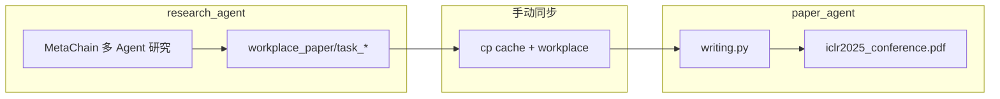
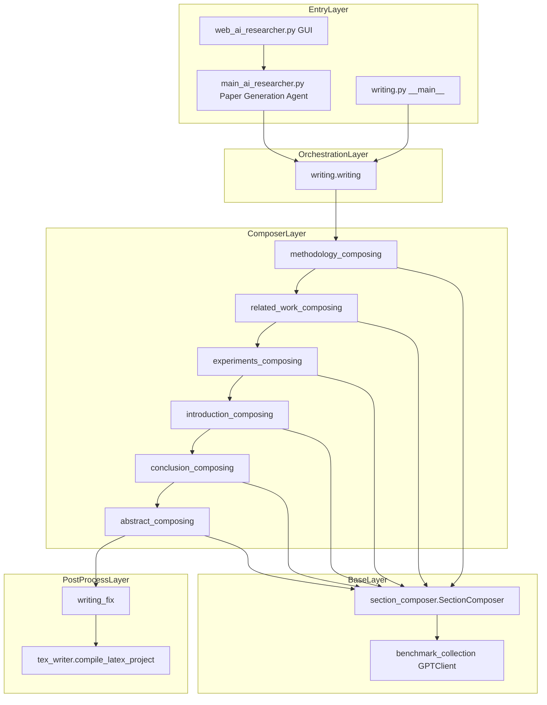
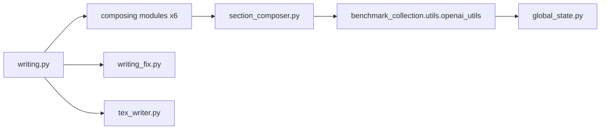
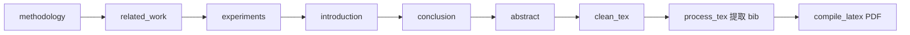
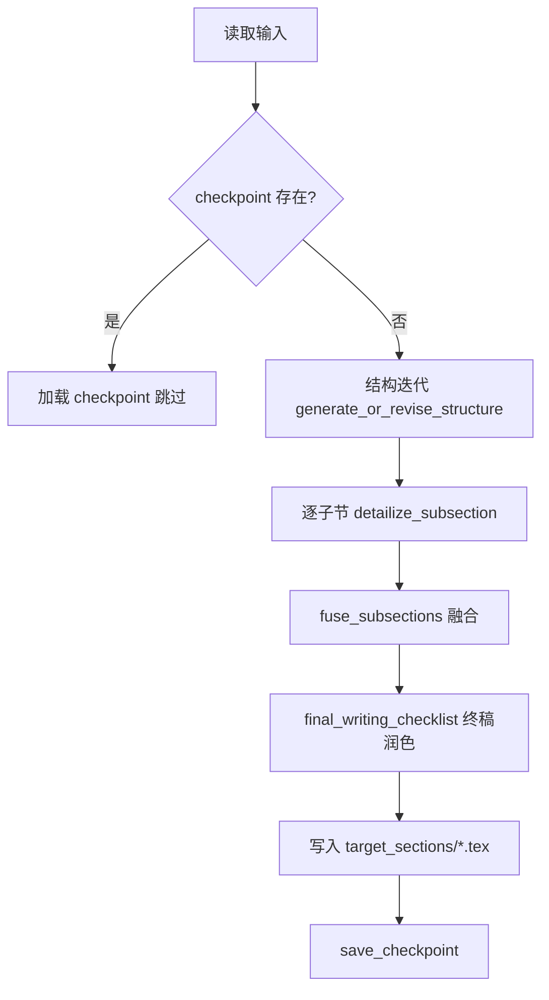

# paper_agent

`paper_agent` 是 AI-Researcher 的**论文写作子项目**，负责在研究智能体（`research_agent`）完成代码实现与实验后，基于 LLM 与领域写作模板，自动生成 ICLR 2025 格式的 LaTeX 论文章节并编译为 PDF。

与 `research_agent` **解耦**（无 Python 互调），通过文件系统目录约定衔接研究产出与写作输入。

---

## 目录

- [1. 子项目作用](#1-子项目作用)
- [2. 在整体流水线中的位置](#2-在整体流水线中的位置)
- [3. 目录结构](#3-目录结构)
- [4. 架构分层](#4-架构分层)
- [5. 模块与文件依赖](#5-模块与文件依赖)
- [6. 请求处理流程](#6-请求处理流程)
- [7. 单章节写作流程（SectionComposer）](#7-单章节写作流程sectioncomposer)
- [8. 如何启动](#8-如何启动)
- [9. 配置与环境变量](#9-配置与环境变量)
- [10. 输入与产出目录](#10-输入与产出目录)
- [11. 研究领域与 Benchmark 映射](#11-研究领域与-benchmark-映射)
- [12. 已知问题与注意事项](#12-已知问题与注意事项)

相关文档：[项目部署指南](../doc/Start.md) · [系统架构](../doc/系统架构.md) · [research_agent 说明](../research_agent/README.md)

---

## 1. 子项目作用

| 能力 | 说明 |
|------|------|
| 方法论写作 | 从 ML Agent 生成的 `model/` 代码与 Agent 对话历史提炼方法章节 |
| 相关工作 | 结合 Survey Agent 输出与 `workplace/papers/` 中 arXiv TeX 撰写 Related Work |
| 实验章节 | 扫描 `workplace/project/` 代码结构与实验分析 Agent 日志，生成 Experiments |
| 引言 / 结论 / 摘要 | 基于已生成章节与 `benchmark/final/` 中 `task1` 描述完成前后章节 |
| LaTeX 后处理与编译 | 清理 LLM 输出、提取 BibTeX、调用 `pdflatex` + `bibtex` 生成 PDF |

**设计特点：**

- 各章节继承统一基类 `SectionComposer`，采用「结构迭代 → 子节细化 → 融合 → 终稿检查」四步流水线
- 从 `writing_templates/` 随机选取参考论文模板，引导 LLM 模仿学术写作风格
- 支持 **checkpoint** 断点续写（按 `instance_id` 与章节名持久化 JSON）

---

## 2. 在整体流水线中的位置



1. `research_agent` 在 Docker 中完成调研、编码、训练与评估
2. 用户将 `cache_*` 与 `workplace/` 复制到 `paper_agent/{field}/{instance_id}/`
3. 运行 `writing.py` 或 Web GUI 的 **Paper Generation Agent** 模式
4. 输出 LaTeX 章节与 PDF

---

## 3. 目录结构

```
paper_agent/
├── writing.py                          # 总编排入口：六章节 + 后处理 + 编译
├── section_composer.py                 # 章节写作抽象基类 SectionComposer
├── methodology_composing_using_template.py
├── related_work_composing_using_template.py
├── experiments_composing.py
├── introduction_composing.py
├── conclusion_composing.py
├── abstract_composing.py
├── writing_fix.py                      # 清理 LLM 输出的 ``` 标记、提取 .bib
├── tex_writer.py                       # pdflatex + bibtex 编译
├── tex_writer_ori.py                   # 旧版编译脚本（备用）
├── run_paper.sh                        # Shell 便捷脚本（需自行配置 API Key）
├── final_paper/                        # ICLR 2025 主模板（需自行准备，见 §12）
│   ├── iclr2025_conference.tex
│   ├── iclr2025_conference.sty
│   └── ...
└── {vq,gnn,rec,diffu_flow}/            # 按领域划分的资源
    ├── writing_templates/              # 各章节写作模板（*_template.txt）
    │   ├── methodology/
    │   ├── related_work/
    │   ├── experiments/
    │   ├── introduction/
    │   ├── conclusion/
    │   └── abstract/
    ├── {instance_id}/                  # 研究产出同步目录（运行时创建）
    │   ├── cache_*/
    │   │   └── agents/
    │   └── workplace/
    ├── temp/                           # 中间日志（运行时生成）
    ├── *_checkpoints/                  # 章节 checkpoint（运行时生成）
    ├── methodology_composition.log
    └── target_sections/                # 若 CWD=paper_agent/ 时的输出位置
```

**运行时还会在仓库根目录生成**（当从根目录启动且 `research_field=vq` 时）：

```
vq/                                     # 与 paper_agent/vq/ 同级，见 §12 路径说明
├── target_sections/{instance_id}/
│   ├── methodology.tex
│   ├── related_work.tex
│   ├── experiments.tex
│   ├── introduction.tex
│   ├── conclusion.tex
│   ├── abstract.tex
│   ├── iclr2025_conference.tex
│   ├── iclr2025_conference.bib
│   └── iclr2025_conference.pdf
├── temp/
└── methodology_composition.log
```

---

## 4. 架构分层



| 层级 | 职责 |
|------|------|
| Entry | CLI 参数解析、Web GUI 模式分发 |
| Orchestration | 按固定顺序 `await` 六章节，最后统一后处理 |
| Composer | 各章节专用 `*Composer` 子类，读取不同输入源 |
| Base | `SectionComposer` 提供目录、checkpoint、模板、LLM 调用 |
| PostProcess | TeX 清理、Bib 提取、PDF 编译 |

---

## 5. 模块与文件依赖

### 5.1 Python import 依赖



| 模块 | 依赖 | 说明 |
|------|------|------|
| [writing.py](./writing.py) | 六个 `*_composing` 模块 | 唯一编排入口 |
| [section_composer.py](./section_composer.py) | `GPTClient` | 所有 Composer 的基类 |
| `*_composing.py` | `SectionComposer` | 各章节专用逻辑 |
| [writing_fix.py](./writing_fix.py) | 无外部依赖 | 纯文件处理 |
| [tex_writer.py](./tex_writer.py) | `subprocess` | 调用系统 `pdflatex` / `bibtex` |
| [benchmark_collection/utils/openai_utils.py](../benchmark_collection/utils/openai_utils.py) | `openai`, `backoff`, `tiktoken`, `global_state` | 异步 LLM 客户端，日志写入 `global_state.LOG_PATH` |

**与 `research_agent` 的关系：** 无 Python import；仅通过 `paper_agent/{field}/{instance_id}/` 下的 JSON 与代码文件衔接。

### 5.2 运行时文件依赖（按章节）

| 章节 | 主要输入路径 | Benchmark |
|------|-------------|-----------|
| Methodology | `cache_*/agents/*.json`、`workplace/project/model/*.py` | `./benchmark/final/{field}/{instance_id}.json` |
| Related Work | `cache_*/agents/prepare_agent.json`、`survey_agent.json`、`workplace/papers/` | 同上 |
| Experiments | `cache_*/agents/experiment_analysis_*.json`、`machine_learning_agent_iter_*.json`、`workplace/project/` | 同上 |
| Introduction | 已生成的 methodology / related_work / experiments `.tex` | 同上（读取 `task1` 字段） |
| Conclusion | 已生成的 introduction / methodology / experiments `.tex` | 无 |
| Abstract | 已生成的 introduction / methodology / experiments `.tex` | 无；并从 `final_paper/` 复制 LaTeX 主模板 |

### 5.3 Agent JSON 文件清单

**Methodology** 读取：

```
prepare_agent.json
survey_agent.json
coding_plan_agent.json
machine_learning_agent.json
judge_agent.json
machine_learning_agent_iter_submit.json
experiment_analysis_agent_iter_refine_1.json
machine_learning_agent_iter_refine_1.json
```

**Related Work** 读取：

```
prepare_agent.json
survey_agent.json
```

**Experiments** 读取：

```
experiment_analysis_agent_iter_refine_1.json
machine_learning_agent_iter_refine_1.json
experiment_analysis_agent_iter_refine_2.json
machine_learning_agent_iter_refine_2.json
```

（部分文件在 Level 1 流水线或迭代次数不足时可能不存在，会导致 `FileNotFoundError`。）

---

## 6. 请求处理流程

### 6.1 总体流水线

[`writing.writing(research_field, instance_id)`](./writing.py) 按以下顺序**串行**执行：



| 步骤 | 函数 | 输出文件 |
|------|------|----------|
| 1 | `methodology_composing` | `{field}/target_sections/{id}/methodology.tex` |
| 2 | `related_work_composing` | `related_work.tex` |
| 3 | `experiments_composing` | `experiments.tex` |
| 4 | `introduction_composing` | `introduction.tex` |
| 5 | `conclusion_composing` | `conclusion.tex` |
| 6 | `abstract_composing` | `abstract.tex` + 复制 `iclr2025_conference.*` |
| 7 | `clean_tex_files_in_folder` | 去除各 `.tex` 首尾 ` ``` ` 行 |
| 8 | `process_tex_file(related_work.tex)` | 分离内嵌 BibTeX → `iclr2025_conference.bib` |
| 9 | `compile_latex_project` | `iclr2025_conference.pdf` |

> **顺序设计说明：** Methodology / Related Work / Experiments 先写，因为它们互相独立且为 Introduction 提供素材；Introduction 在 Experiments 之后，以便引用实验结论；Conclusion 与 Abstract 最后写，依赖前面全部章节。

### 6.2 各章节数据来源差异

```
methodology_composing
  ├── 读 ./paper_agent/{field}/{id}/cache_*/agents/
  ├── 读 ./paper_agent/{field}/{id}/workplace/project/model/
  └── 读 ./benchmark/final/{field}/{id}.json

related_work_composing
  ├── 读 agents/（prepare + survey）
  ├── 读 workplace/papers/（arXiv TeX 全文）
  └── 读 benchmark JSON（source_papers 元数据）

experiments_composing
  ├── 读 agents/（实验分析 + ML 迭代）
  └── 扫描 workplace/project/ 全部 .py

introduction_composing
  ├── 读已生成 .tex（methodology + related_work + experiments）
  └── 读 benchmark JSON 的 task1 字段

conclusion_composing / abstract_composing
  └── 读已生成 .tex（不再访问 agent 目录）
```

### 6.3 LaTeX 编译流程

[`tex_writer.compile_latex_project`](./tex_writer.py) 在目标目录内执行：

```
pdflatex iclr2025_conference.tex
bibtex iclr2025_conference        # 若 .aux 存在
pdflatex iclr2025_conference.tex
pdflatex iclr2025_conference.tex
```

需要系统已安装 TeX Live / MacTeX，且 `pdflatex`、`bibtex` 在 `PATH` 中。

---

## 7. 单章节写作流程（SectionComposer）

所有 `*Composer` 继承 [`SectionComposer`](./section_composer.py)，共享以下模式：



| 机制 | 路径 | 作用 |
|------|------|------|
| 临时日志 | `{field}/temp/{timestamp}_{step}.log` | 调试每次 LLM 输出 |
| Checkpoint | `{field}/{section}_checkpoints/{instance_id}/{step}.json` | 断点续写（structure / subsections） |
| 写作模板 | `{field}/writing_templates/{section}/*_template.txt` | 随机选取，注入 detailize prompt |
| LLM 调用 | `GPTClient.chat(prompt)` | 默认模型 `gpt-4o-mini-2024-07-18` |

**Introduction / Conclusion / Abstract** 简化为「结构迭代 → 整节写作 → 终稿检查」，不做子节融合。

---

## 8. 如何启动

### 8.1 前置条件

1. **Python 环境**：已在仓库根目录执行 `pip install -r requirements.txt`（`-e .` 安装 `paper_agent` 包）
2. **API 配置**：根目录 `.env` 或环境变量中设置 `OPENAI_API_KEY`；若使用代理/第三方网关，设置 `API_BASE_URL`
3. **TeX 工具链**：`pdflatex`、`bibtex` 可用
4. **研究产出已同步**：见 [§10.2](#102-从-research_agent-同步输入)
5. **LaTeX 主模板**：`paper_agent/final_paper/` 目录存在且含 `iclr2025_conference.tex`（见 [§12](#12-已知问题与注意事项)）

### 8.2 方式一：CLI（推荐）

**工作目录：仓库根目录 `AI-Researcher/`**

```bash
cd /path/to/AI-Researcher
export OPENAI_API_KEY=sk-...
# 可选：export API_BASE_URL=https://...

python paper_agent/writing.py \
  --research_field vq \
  --instance_id rotation_vq
```

参数说明：

| 参数 | 默认值 | 含义 |
|------|--------|------|
| `--research_field` | `vq` | 领域目录名，对应 `paper_agent/{field}/` |
| `--instance_id` | `rotation_vq` | 任务实例 ID，与 benchmark JSON 文件名一致 |

### 8.3 方式二：Web GUI

```bash
python web_ai_researcher.py
```

1. 在 Environment 标签页设置 `CATEGORY`、`INSTANCE_ID` 并 Save
2. 选择模式 **Paper Generation Agent**
3. 点击 Run

GUI 通过 [`main_ai_researcher.py`](../main_ai_researcher.py) 调用 `paper_agent.writing.writing(category, instance_id)`。

### 8.4 方式三：Python 编程调用

```python
import asyncio
from dotenv import load_dotenv
from main_ai_researcher import main_ai_researcher

load_dotenv()

main_ai_researcher(
    input="",
    reference="",
    mode="Paper Generation Agent",
)
```

需在 `.env` 中配置 `CATEGORY` 与 `INSTANCE_ID`。

### 8.5 方式四：单章节调试

各 composing 模块均支持独立运行（需在仓库根目录）：

```bash
python -m paper_agent.methodology_composing_using_template
python -m paper_agent.related_work_composing_using_template
python -m paper_agent.experiments_composing
python -m paper_agent.introduction_composing
python -m paper_agent.conclusion_composing
python -m paper_agent.abstract_composing
```

### 8.6 Shell 脚本

[`run_paper.sh`](./run_paper.sh) 为示例脚本，需填写 `OPENAI_API_KEY` 后从仓库根目录执行：

```bash
bash paper_agent/run_paper.sh
```

---

## 9. 配置与环境变量

Paper Agent 复用根目录 `.env`，主要使用以下变量：

| 变量 | 用途 |
|------|------|
| `OPENAI_API_KEY` | LLM API 密钥（`GPTClient` 必填） |
| `API_BASE_URL` | OpenAI 兼容网关地址（可选） |
| `CATEGORY` | GUI / `main_ai_researcher` 模式下的 `research_field` |
| `INSTANCE_ID` | 任务实例 ID |

LLM 相关配置在 [`GPTClient`](../benchmark_collection/utils/openai_utils.py) 中硬编码默认模型为 `gpt-4o-mini-2024-07-18`；各 `*Composer` 构造函数可传入 `gpt_model` 覆盖。

日志：

- 章节写作日志：`{research_field}/methodology_composition.log`
- GUI 模式 LLM 详细日志：`paper_agent/paper_logs/`（由 `web_ai_researcher.return_paper_log` 配置）

---

## 10. 输入与产出目录

### 10.1 Paper Agent 期望输入

[`methodology_composing`](./methodology_composing_using_template.py) 等模块约定：

```
paper_agent/{research_field}/{instance_id}/
├── cache_{...}/              # 必须存在，取字典序最后一个 cache_* 目录
│   └── agents/               # Agent 对话 JSON
└── workplace/
    ├── project/
    │   └── model/            # Methodology 读取的模型代码
    └── papers/               # Related Work 读取的 arXiv TeX
```

同时需要：

```
benchmark/final/{research_field}/{instance_id}.json
```

### 10.2 从 research_agent 同步输入

Research Agent 产出路径（`COMPLETION_MODEL` 中 `/` 替换为 `__`）：

```
research_agent/workplace_paper/task_{INSTANCE_ID}_{MODEL}/
├── cache_{INSTANCE_ID}_{MODEL}/agents/
└── workplace/
```

同步示例：

```bash
SRC=research_agent/workplace_paper/task_rotation_vq_openrouter__google__gemini-2.5-pro-preview-05-20
DST=paper_agent/vq/rotation_vq

mkdir -p "$DST"
cp -r "$SRC/cache_"* "$DST/"
cp -r "$SRC/workplace" "$DST/"
```

### 10.3 输出路径

代码将章节写入：

```
{research_field}/target_sections/{instance_id}/
```

该路径**相对于进程当前工作目录（CWD）**。从仓库根目录启动时，PDF 实际位于：

```
vq/target_sections/rotation_vq/iclr2025_conference.pdf   # 示例
```

而非 `paper_agent/vq/target_sections/...`。Web GUI 下载路径与根目录输出一致（`{CATEGORY}/target_sections/{INSTANCE_ID}/`）。

---

## 11. 研究领域与 Benchmark 映射

| paper_agent 目录 (`--research_field`) | benchmark 目录 | 说明 |
|---------------------------------------|----------------|------|
| `vq` | `benchmark/final/vq/` | 向量量化 |
| `gnn` | `benchmark/final/gnn/` | 图神经网络 |
| `rec` | `benchmark/final/recommendation/` | **目录名不一致**，见下方 |
| `diffu_flow` | `benchmark/final/diffu_flow/` | 扩散 / 流匹配 |

`.env` 中 `CATEGORY` 使用 benchmark 目录名（如 `recommendation`），而写作模板在 `paper_agent/rec/`。运行推荐任务时需：

- 同步数据到 `paper_agent/rec/{instance_id}/`
- 使用 `--research_field rec`
- 确保 benchmark JSON 可访问（例如创建软链接 `benchmark/final/rec` → `recommendation`，或将 JSON 复制到 `benchmark/final/rec/`）

---

## 12. 已知问题与注意事项

### 12.1 路径约定不一致

- **输入路径**使用 `./paper_agent/{field}/{id}/`（假定 CWD = 仓库根目录）
- **输出路径**使用 `{field}/target_sections/{id}/`（无 `paper_agent/` 前缀）

因此应从**仓库根目录**启动，输出会出现在根目录下的 `{field}/` 而非 `paper_agent/{field}/`。部分文档写为 `paper_agent/vq/target_sections/...`，与当前代码行为不符。

### 12.2 `final_paper/` 模板缺失

[`abstract_composing`](./abstract_composing.py) 最后一步从 `./paper_agent/final_paper/` 复制 ICLR 主模板到输出目录。该目录**未纳入版本库**，需自行准备 `iclr2025_conference.tex`、`.sty` 等文件，否则 Abstract 阶段会 `FileNotFoundError`。

### 12.3 `experiments_composing` checkpoint 逻辑

存在 checkpoint 时，[`experiments_composing.py`](./experiments_composing.py) 在加载 structure 后直接调用 `exit()`，会导致进程异常退出而非续跑。删除 `{field}/experiments_checkpoints/{instance_id}/` 可强制重新生成。

### 12.4 Agent JSON 文件缺失

Experiments 阶段依赖 `*_iter_refine_2.json` 等迭代文件；若研究流水线迭代次数不足，需手动创建占位文件或修改 `agent_files` 列表。

### 12.5 耗时与费用

完整六章节流水线会对每个子节、每份 Agent JSON 多次调用 LLM，耗时长、Token 消耗大。建议：

- 开发调试时单独运行某一 composing 模块
- 利用 checkpoint 机制避免重复生成
- 在 [`SectionComposer.__init__`](./section_composer.py) 或各 Composer 中调低 `structure_iterations`

### 12.6 包结构

`setup.cfg` 将 `paper_agent*` 纳入安装包，但目录内无 `__init__.py`；`from paper_agent import writing` 依赖 editable install（`pip install -e .`）。若 import 失败，请确认已在根目录安装项目。

---

## 快速参考

```bash
# 1. 同步研究产出
cp -r research_agent/workplace_paper/task_<id>_<model>/cache_* paper_agent/vq/<id>/
cp -r research_agent/workplace_paper/task_<id>_<model>/workplace paper_agent/vq/<id>/

# 2. 配置 API
export OPENAI_API_KEY=sk-...

# 3. 生成论文（仓库根目录）
python paper_agent/writing.py --research_field vq --instance_id rotation_vq

# 4. 查看 PDF
open vq/target_sections/rotation_vq/iclr2025_conference.pdf
```
