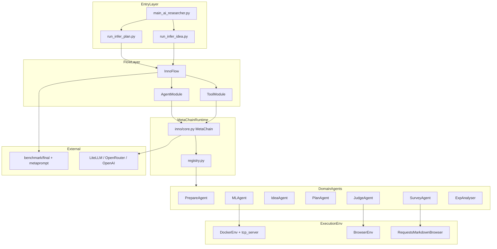
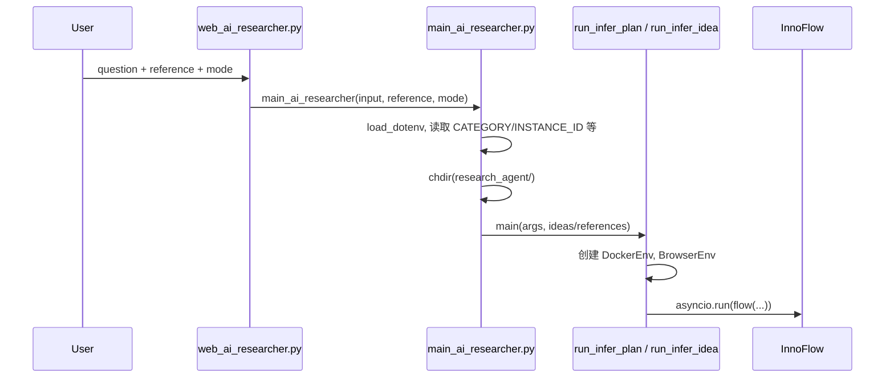
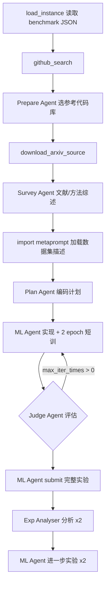
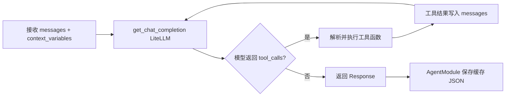

# research_agent

`research_agent` 是 AI-Researcher 的**研究智能体子项目**，负责从用户给定的研究想法或参考论文出发，自动完成文献调研、代码库准备、算法设计、Docker 内实现与实验、结果评估与迭代优化。

底层运行时基于 **MetaChain** 框架（`inno/` 目录，源自 metachain 思路），通过 LiteLLM 统一调用大模型，以 Function Calling 驱动多 Agent 协作。

---

## 目录

- [1. 子项目作用](#1-子项目作用)
- [2. 目录结构](#2-目录结构)
- [3. 架构分层](#3-架构分层)
- [4. 模块与文件依赖](#4-模块与文件依赖)
- [5. 请求处理流程](#5-请求处理流程)
- [6. MetaChain 单次 Agent 执行流程](#6-metachain-单次-agent-执行流程)
- [7. 如何启动](#7-如何启动)
- [8. 配置与环境变量](#8-配置与环境变量)
- [9. 产出目录](#9-产出目录)
- [10. 扩展开发指南](#10-扩展开发指南)

相关文档：[项目部署指南](../doc/Start.md) · [系统架构](../doc/系统架构.md)

---

## 1. 子项目作用

| 能力 | 说明 |
|------|------|
| 文献与代码准备 | GitHub 搜索、克隆参考仓库、下载 arXiv TeX 源码 |
| 创意与调研 | Level 2 自动生成想法；Survey / Code Survey 产出方法综述 |
| 计划与实现 | Plan Agent 制定编码计划；ML Agent 在 Docker 中写代码并训练 |
| 评估与迭代 | Judge Agent 评估实现；Exp Analyser 分析实验并驱动进一步实验 |
| 断点续跑 | Agent / Tool 结果缓存到 JSON，支持 Yes / Resume / No 交互式恢复 |

**两条主流水线：**

| 入口文件 | 模式 | 用户输入 |
|----------|------|----------|
| [run_infer_plan.py](./run_infer_plan.py) | Level 1 | 详细研究想法 + 参考论文 |
| [run_infer_idea.py](./run_infer_idea.py) | Level 2 | 仅参考论文（Idea Agent 生成想法） |

---

## 2. 目录结构

```
research_agent/
├── constant.py              # 环境变量与全局模型配置
├── run_infer_plan.py        # Level 1 流水线入口（InnoFlow）
├── run_infer_idea.py        # Level 2 流水线入口（InnoFlow + Idea Agent）
├── run_infer_level_1.sh     # Shell 便捷脚本（不推荐直接使用，见启动说明）
├── run_infer_level_2.sh
└── inno/                    # MetaChain 运行时框架
    ├── core.py              # MetaChain：LLM 调用、工具循环、重试
    ├── types.py             # Agent / Response / Result 类型
    ├── registry.py          # @register_agent / @register_tool 注册表
    ├── fn_call_converter.py # 非原生 FC 模型的工具调用格式转换
    ├── util.py              # 消息构造、菜单交互、JSON 工具等
    ├── logger.py            # MetaChainLogger 结构化日志
    ├── cli.py               # 单 Agent 调试 CLI（mc agent）
    ├── workflow/
    │   ├── flowcache.py     # FlowModule / AgentModule / ToolModule + 缓存
    │   └── flowgraph.py     # NetworkX 工作流图（辅助）
    ├── agents/
    │   └── inno_agent/      # 领域 Agent 工厂函数
    │       ├── prepare_agent.py
    │       ├── survey_agent.py
    │       ├── idea_agent.py
    │       ├── plan_agent.py
    │       ├── ml_agent.py
    │       ├── judge_agent.py
    │       └── exp_analyser.py
    ├── tools/               # Agent 可调用的工具（自动递归 import 注册）
    │   ├── terminal_tools.py
    │   ├── inno_tools/      # code_search, paper_search, web_tools 等
    │   └── ...
    ├── environment/         # 代码执行与浏览环境
    │   ├── docker_env.py    # Docker 容器生命周期 + TCP 命令执行
    │   ├── browser_env.py   # Playwright / BrowserGym
    │   └── markdown_browser/
    └── memory/              # ChromaDB RAG 记忆（代码/论文/工具检索）
```

运行时还会在 `research_agent/` 下生成（已 gitignore）：

```
workplace_paper/task_{instance_id}_{model}/
├── cache_{instance_id}_{model}/agents/   # Agent 对话缓存
├── cache_{instance_id}_{model}/tools/    # Tool 结果缓存
├── log_{instance_id}/                    # 运行日志
└── workplace/
    ├── project/                          # ML Agent 生成的代码
    └── papers/                           # 下载的 arXiv TeX
```

---

## 3. 架构分层



---

## 4. 模块与文件依赖

### 4.1 入口层依赖

```
main_ai_researcher.py（项目根目录）
  ├── load_dotenv() → .env
  ├── research_agent.constant → COMPLETION_MODEL 等
  ├── run_infer_plan.main(args, input, reference)   # Level 1
  └── run_infer_idea.main(args, reference)          # Level 2

run_infer_plan.py / run_infer_idea.py
  ├── inno.workflow.flowcache → FlowModule, AgentModule, ToolModule
  ├── inno.agents.inno_agent.* → get_*_agent 工厂
  ├── inno.environment.docker_env → DockerEnv
  ├── inno.environment.browser_env → BrowserEnv
  ├── research_agent.constant → COMPLETION_MODEL, CHEEP_MODEL
  └── importlib → benchmark.process.dataset_candidate.{category}.metaprompt
```

### 4.2 MetaChain 内部依赖

```
inno/core.py (MetaChain)
  ├── litellm.completion / acompletion
  ├── research_agent.constant → API_BASE_URL, FN_CALL 相关开关
  ├── fn_call_converter.py → 工具描述与消息格式转换
  └── types.py → Agent, Response, Result

inno/agents/inno_agent/*.py
  ├── @register_agent 装饰器 → registry.py
  ├── inno/tools/* → 工具函数（execute_command, read_file 等）
  └── DockerEnv + @with_env → 注入 code_env 到工具闭包

inno/tools/__init__.py
  └── 递归 import inno/tools/**/*.py → 自动注册 @register_tool
```

### 4.3 Docker 命令执行链

ML Agent / Prepare Agent 的工具（如 `execute_command`）最终通过 TCP 进入容器：

```
Agent 调用 tool
  → terminal_tools.execute_command
  → @with_env 注入 DockerEnv
  → docker_env.DockerEnv.run_command
  → socket.connect(localhost, PORT)
  → 容器内 docker/tcp_server.py 执行 shell
  → JSON 流式返回 {type: chunk|final, ...}
```

宿主机 `PORT`（如 7020）映射到容器 **8000** 端口。

### 4.4 与项目其他模块的关系

| 模块 | 关系 |
|------|------|
| `benchmark/final/*.json` | 任务定义（source_papers、task1/task2） |
| `benchmark/process/dataset_candidate/{category}/metaprompt.py` | 数据集、基线、指标描述（动态 import） |
| `paper_agent/` | **无直接 import**；研究完成后需手动复制 workplace/cache 到 paper_agent |
| `global_state.py` | 提供 `LOG_PATH`，供 constant.py 与 Web GUI 共享日志路径 |

---

## 5. 请求处理流程

### 5.1 从用户输入到流水线启动



### 5.2 Level 1 流水线（run_infer_plan.InnoFlow）



**各阶段输入/output 摘要：**

| 步骤 | 模块类型 | 主要输入 | 主要产出 |
|------|----------|----------|----------|
| 1 | ToolModule | `instance_path`, `task_level` | metadata（论文列表、日期限制） |
| 2 | ToolModule | metadata | GitHub 搜索结果字符串 |
| 3 | AgentModule | ideas + references + github_result | prepare_res（选定仓库 JSON） |
| 4 | ToolModule | paper_list | 下载的 TeX 路径信息 |
| 5 | AgentModule | 上述全部 | survey_res（模型综述） |
| 6 | 动态 import | category | dataset_description |
| 7 | AgentModule | survey + dataset | plan_res（实现计划） |
| 8 | AgentModule | plan + ideas | workplace/project/ 代码 |
| 9–11 | AgentModule | 实验结果 | judge / submit / refine |

### 5.3 Level 2 差异（run_infer_idea.InnoFlow）

在 Prepare 之后、Plan 之前，**用 Idea Agent 替代 Survey Agent**：

```
Prepare → download_arxiv
  → Idea Agent ×5 生成想法
  → Idea Agent select 筛选最优
  → Code Survey Agent 代码实现报告
  → Plan → ML → Judge → Exp（同 Level 1）
```

Level 2 的 `forward()` **不接收** `ideas` 参数，想法由 Idea Agent 从 `metaprompt.TASK` 与参考论文中生成。

---

## 6. MetaChain 单次 Agent 执行流程

每个 `AgentModule` 调用底层 `MetaChain.run_async()`，核心循环在 [inno/core.py](./inno/core.py)：



**关键机制：**

- **模型路由**：Agent 工厂传入 `model=CHEEP_MODEL` 或 `COMPLETION_MODEL`（来自 [constant.py](./constant.py)）
- **工具注册**：`Agent.functions` 列表 + `@register_agent` 工厂返回的 Agent 实例
- **上下文传递**：工具可通过 `context_variables` 参数读写共享状态（如 `prepare_result`、`experiment_report`）
- **非原生 FC 模型**：[fn_call_converter.py](./inno/fn_call_converter.py) 将工具描述注入 system prompt，并解析文本格式的工具调用
- **缓存**：[flowcache.py](./inno/workflow/flowcache.py) 每步完成后写入 `{cache_path}/agents/{agent_name}.json`

---

## 7. 如何启动

### 7.1 推荐：通过项目根目录 Web GUI

```bash
# 项目根目录
cp .env.template .env   # 配置 API Key、CATEGORY、INSTANCE_ID 等
python web_ai_researcher.py
# 浏览器打开 http://127.0.0.1:7039
```

在 GUI 中选择模式并填写输入：

| GUI 模式 | 调用链 |
|----------|--------|
| Detailed Idea Description | → `run_infer_plan.main(args, input, reference)` |
| Reference-Based Ideation | → `run_infer_idea.main(args, reference)` |

详见 [doc/Start.md](../doc/Start.md)。

### 7.2 推荐：Python 调用 main_ai_researcher

```python
# 在项目根目录执行
from dotenv import load_dotenv
load_dotenv()

from main_ai_researcher import main_ai_researcher

# Level 1
main_ai_researcher(
    input="你的详细研究想法...",
    reference="参考论文列表...",
    mode="Detailed Idea Description",
)

# Level 2
main_ai_researcher(
    input="",
    reference="参考论文列表...",
    mode="Reference-Based Ideation",
)
```

`main_ai_researcher` 会：

1. 从 `.env` 读取 `CATEGORY`、`INSTANCE_ID`、`PORT`、`COMPLETION_MODEL` 等
2. `os.chdir("research_agent/")`
3. 构造 `args.instance_path = ../benchmark/final/{category}/{instance_id}.json`
4. 调用对应 `main()`

### 7.3 前置条件

启动前需确保：

```bash
# 1. Python 依赖
pip install -r requirements.txt
playwright install

# 2. Docker 研究镜像
docker pull tjbtech1/airesearcher:v1

# 3. .env 中至少配置
# OPENROUTER_API_KEY / COMPLETION_MODEL / CHEEP_MODEL
# CATEGORY / INSTANCE_ID / PORT / BASE_IMAGES / GPUS
```

### 7.4 不推荐的方式

```bash
# ❌ main() 需要 ideas/references，直接运行会 TypeError
python run_infer_plan.py --instance_path ...

# ❌ Shell 脚本同样缺少 ideas/references 参数
bash run_infer_level_1.sh
```

### 7.5 单 Agent 调试（inno/cli.py）

[inno/cli.py](./inno/cli.py) 提供底层 CLI，用于单独调试某个 Agent：

```bash
### 7.4 单 Agent 调试（CLI）

Prepare Agent 依赖 **Docker**（会在容器内 `git clone` 仓库）。DeepSeek 需在根目录 `.env` 配置：

```bash
DEEPSEEK_API_KEY=sk-你的密钥
API_BASE_URL=https://api.deepseek.com
CHEEP_MODEL=deepseek/deepseek-chat
GITHUB_AI_TOKEN=ghp_你的GitHubToken   # git clone 需要
BASE_IMAGES=tjbtech1/airesearcher:v1
PORT=7020
```

**完整可执行命令**（仓库根目录已安装依赖、`docker ps` 正常）：

```bash
cd research_agent

# 1. 拉取镜像（首次）
docker pull tjbtech1/airesearcher:v1

# 2. 运行 Prepare Agent（DeepSeek + rotation_vq 测试 query）
python -m inno.cli agent \
  --model=deepseek/deepseek-chat \
  --agent_func=get_prepare_agent \
  --container_name=paper_eval_cli_vq \
  --port=7020 \
  --query="$(cat cli_debug/prepare_agent_query_rotation_vq.txt)" \
  working_dir=workplace \
  date_limit=2024-12-31
```

说明：

| 项 | 值 |
|----|-----|
| 模型 | `deepseek/deepseek-chat`（LiteLLM 格式；内部走非原生 FC 转换） |
| `--query` | 见 [`cli_debug/prepare_agent_query_rotation_vq.txt`](./cli_debug/prepare_agent_query_rotation_vq.txt)，结构与 `run_infer_plan.py` 中 Prepare 阶段一致 |
| `working_dir` | 对应容器内 `/workplace`，Agent 在此 clone 仓库 |
| `date_limit` | GitHub 搜索日期上限（query 内已含模拟搜索结果，此项为 context 默认值） |

> 该测试会真实 clone 5+ 个 GitHub 仓库到 Docker 工作区，耗时较长并消耗 DeepSeek API 额度。若仅验证 LLM 连通性，可改用 `--no-init-docker` 配合不依赖 Docker 的 agent（Prepare Agent 必须带 Docker）。

旧版 CLI 从 `metachain.agents` 导入的问题已修复，现从 `research_agent.inno.registry` 加载 agent。

---

## 8. 配置与环境变量

配置由 [constant.py](./constant.py) 在 import 时从 `.env` 加载。完整说明见项目根目录 [.env.template](../.env.template)。

**research_agent 直接使用的变量：**

| 变量 | 用途 |
|------|------|
| `COMPLETION_MODEL` | ML Agent 主模型 |
| `CHEEP_MODEL` | Prepare / Survey / Plan / Judge / Exp 等辅助 Agent |
| `BASE_IMAGES` | Docker 镜像 |
| `GPUS` | GPU 分配 |
| `PORT` | 宿主机 → 容器 tcp_server 端口 |
| `GITHUB_AI_TOKEN` | GitHub 搜索与 clone |
| `OPENROUTER_API_KEY` | LiteLLM 调用 OpenRouter 模型 |
| `API_BASE_URL` | OpenAI 兼容 API 代理 |
| `CATEGORY` / `INSTANCE_ID` | 由 main_ai_researcher 传入 benchmark 路径 |
| `MAX_ITER_TIMES` | Judge ↔ ML 精炼迭代次数 |

**已知问题：**

- `docker_env.py` 导入 `PLATFORM`，但 `constant.py` 未定义；需在 `constant.py` 添加 `PLATFORM = os.getenv('PLATFORM', 'linux/amd64')`（见 [doc/Start.md](../doc/Start.md)）
- `constant.py` 中 `BASE_IMAGES` 默认值与 `.env.template` 不一致，务必在 `.env` 显式设置

---

## 9. 产出目录

单次任务产出路径（`cwd` 为 `research_agent/` 时）：

```
workplace_paper/task_{INSTANCE_ID}_{MODEL_SLUG}/workplace/project/   # 代码与实验
workplace_paper/task_{INSTANCE_ID}_{MODEL_SLUG}/cache_{INSTANCE_ID}_{MODEL_SLUG}/  # 缓存
workplace_paper/task_{INSTANCE_ID}_{MODEL_SLUG}/log_{INSTANCE_ID}/   # 日志
```

其中 `MODEL_SLUG = COMPLETION_MODEL.replace("/", "__")`。

**对接 paper_agent：** 将 `cache_*` 与 `workplace/` 复制到 `paper_agent/{CATEGORY}/{INSTANCE_ID}/` 后，再运行论文生成流水线。见 [doc/Start.md §7](../doc/Start.md)。

---

## 10. 扩展开发指南

### 10.1 新增 Agent

1. 在 `inno/agents/inno_agent/` 下创建文件
2. 使用 `@register_agent("get_xxx_agent")` 装饰工厂函数
3. 工厂返回 `Agent(name=..., model=..., instructions=..., functions=[...])`
4. 在 `InnoFlow.__init__` 中包装为 `AgentModule(get_xxx_agent(...), self.client, cache_path)`
5. 在 `forward()` 中 `await self.xxx_agent(messages, context_variables)`

### 10.2 新增 Tool

1. 在 `inno/tools/` 下创建模块并 `@register_tool` 注册
2. 若需 Docker 环境，参考 [terminal_tools.py](./inno/tools/terminal_tools.py) 使用 `@with_env` 装饰器
3. 将工具函数加入对应 Agent 的 `functions` 列表

### 10.3 新增 Benchmark 领域

1. 在 `benchmark/final/{category}/` 添加 JSON 实例
2. 在 `benchmark/process/dataset_candidate/{category}/metaprompt.py` 提供 `TASK`、`DATASET`、`BASELINE` 等
3. `.env` 中设置 `CATEGORY={category}`

---

## Agent 职责速查

| Agent | 文件 | 模型 | 职责 |
|-------|------|------|------|
| Prepare | `prepare_agent.py` | CHEEP | 从 GitHub 结果中选择 ≥5 个参考代码库并 clone |
| Survey | `survey_agent.py` | CHEEP | Level 1：文献与方法综述 |
| Idea | `idea_agent.py` | CHEEP | Level 2：生成并筛选创新想法 |
| Code Survey | `idea_agent.py`（工厂） | CHEEP | Level 2：基于代码库的实现报告 |
| Plan | `plan_agent.py` | CHEEP | 结合 metaprompt 生成详细编码计划 |
| ML | `ml_agent.py` | COMPLETION | Docker 内实现、训练、测试代码 |
| Judge | `judge_agent.py` | CHEEP | 评估实现是否符合想法 |
| Exp Analyser | `exp_analyser.py` | CHEEP | 分析实验结果，规划进一步实验 |
